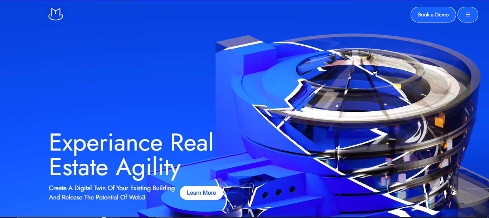
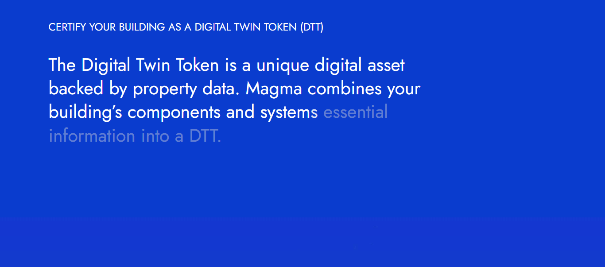
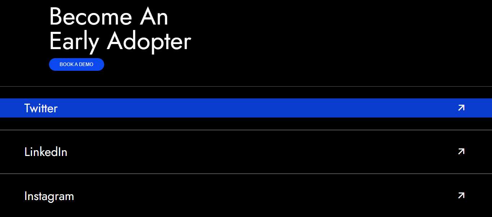

# 🔥 Magma Landing Page Clone

> A pixel-perfect clone of [thisismagma.com](https://thisismagma.com/) — built with pure HTML, CSS, JavaScript, GSAP, Locomotive.js, and custom Canvas animations. Scroll like a boss, vibe like magma. 💥🔥

---

## 🚀 Live Demo

👉 [Click here to see it live](https://kahkasha17.github.io/thisismagma-clone/)  

---

## ⚙️ What’s Inside?

- Clean and semantic **HTML5**
- Fully styled with **CSS3**
- **JavaScript** interactions
- Smooth scroll via **Locomotive.js**
- Crazy cool scroll-based **GSAP** animations
- **Canvas animations** for an immersive experience
- No frameworks — just handcrafted awesomeness

---

## 🧠 Tech Stack

- HTML5
- CSS3
- JavaScript
- GSAP (GreenSock Animation Platform)
- Locomotive.js
- Canvas API

---

## 📸 Preview

<!-- Option 1: Markdown-style preview -->
### 🖼️ Hero Section  

### 🖼️ About Section  

### 🖼️ Feature Section  

### 🖼️ Footer  

<!-- Option 2: Row layout using HTML -->
<!--
<h3>📸 Preview</h3>

  
  
  

-->

---

## 🔖 GitHub Topics

Add these in the “Topics” section on GitHub:

-magma-clone
-frontend-clone
-html-css-js
-gsap-animation
-locomotive-scroll
-canvas-animation
-animated-landing-page
-javascript-project
-web-clone
-advanced-scroll
-creative-design
-ui-ux-clone
-smooth-scrolling
-landing-page-clone
-motion-design

---

## 📬 Let’s Connect

Drop a ⭐ if you like this clone, or hit me up for feedback, collabs, or code talk! 😎  
